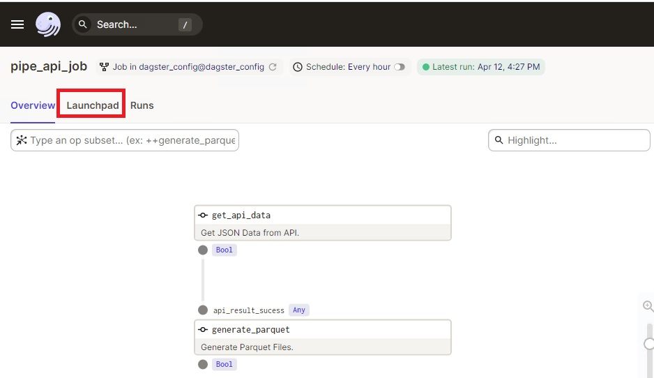
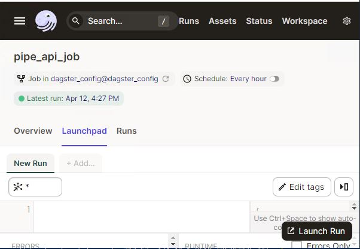
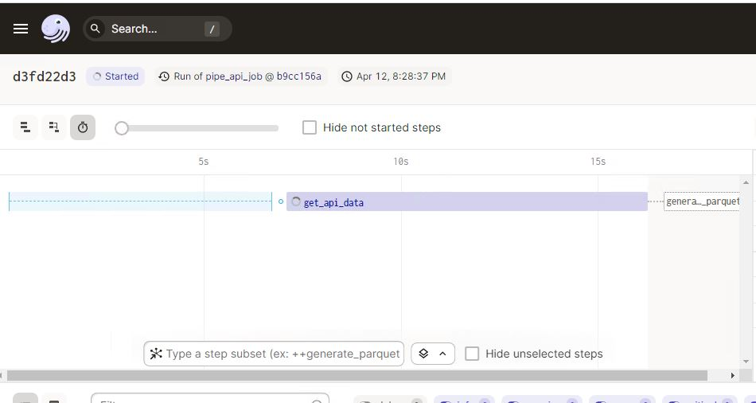

# Analytics-Middle-Tier-Data-Lake

## API to AMT Data Lake
Extracts all data exposed by the Ed-Fi API and saves it into JSON files in order to be consumed and transformed (on a second phase) in another project.

## Getting Started

1. Requires Python 3.9+ and Poetry.
1. Install required Python packages.

## Local environment
Authentication is necessary to be able to download the different collections.


#### Environment variable configuration:

1. Rename the .env.example file to .env, or generate an .env file using .env.example as a reference.
2. Modify the .env file to include your information.

```shi
# API connnection configuration:
API_URL=<your_ods_api_url>
API_KEY=<your_secret_key>
API_SECRET=<your_secret_password>
API_MODE=SharedInstance
SCHOOL_YEAR=2021,2022

# API connnection configuration variables you very unlikely will have to change; unless you really know what you are doing:
PREX_DATA_V=data/v3
PREX_TOKEN=oauth/token
AVAILABLE_CHANGE_VERSIONS=ChangeQueries/v1/{0}availableChangeVersions
API_LIMIT=500

# Folders where data will be stored:
CHANGE_VERSION_FILEPATH=C:\\temp\\edfi\\
SILVER_DATA_LOCATION=C:\\temp\\edfi\\json\\
PARQUET_FILES_LOCATION=C:\\temp\\edfi\\parquet\\

# Variables you very unlikely will have to change; unless you really know what you are doing:
OS_CPU=4
DISABLE_CHANGE_VERSION=True

# Development settings:
LOG_LEVEL=info
REQUESTS_CERT_VERIFICATION=True
GENERATE_SILVER_DATA=True
GENERATE_GOLD_DATA=False
```

**API_URL:** URL to get connected to the ODS API.
**API_KEY:** Key value to get connected to the ODS API.
**API_SECRET:** Secret value to get connected to the ODS API.
**API_MODE:** SharedInstance or YearSpecific mode.
**SCHOOL_YEAR:** If API_MODE is YearSpecific, you must set a list of school years that you want to load, separated by commas. Otherwise this value is not used.

**API_LIMIT:** Number of resources requested at a time to the ODS API. In other words, used to consume the pagination feature of the ODS API.

**CHANGE_VERSION_FILEPATH:** The location where the change query values will be saved.
**SILVER_DATA_LOCATION:** The location where the raw data will be saved., The raw data is a collection of json files in an staging phase.
**PARQUET_FILES_LOCATION:** The location where the data in its final structure will be stored.

**GENERATE_SILVER_DATA:** Set this value True when you want to generate the raw data. False otherwise.
Take into account that when you set this value to False, and the json files do not exist in the corresponding folder, all the parquet files generated will be empty.

**GENERATE_GOLD_DATA:** Set this value True when you want to generate the parquet files. False otherwise.

**OS_CPU:** Defined as the number of CPUs to be used for parallel calls, this value must be less than the number of CPUs of the machine for proper performance.
**DISABLE_CHANGE_VERSION:** For the current version, the change query version feature has been disabled.
This simply means that every time the project is executed, all data is requested.

**REQUESTS_CERT_VERIFICATION:** In case you are executing the project on a local development environment and you have not set up a SSL certificate, this value should be False.
The system will throw a number of warnings. For local development environment this is okay.

Once the environment variables have been configured. Continue with the following commands to prepare the execution of the project.

#### For Linux:

```sh
cd ./src
poetry install
source  $(poetry env info --path)/bin/activate
cd ./edfi_amt_data_lake
mkdir ~/dagster_home
export DAGSTER_HOME=~"/dagster_home"
dagster instance info
cp -R dagster.yaml ~/dagster_home/
dagit -w workspace.yaml
```

#### For Windows:

```sh
cd ./src
poetry install
& (join-path (poetry env info --path) "\Scripts\activate.ps1")
cd ./edfi_amt_data_lake
mkdir ~/dagster_home
$env:DAGSTER_HOME = ($home + '\dagster_home')
dagster instance info
cp -R dagster.yaml ~/dagster_home/
dagit -w workspace.yaml
```

After you have finished the above steps, you can open your localhost or http://127.0.0.1:3000 and you will be able to see in the launcher the list of tests or collections available. You can click on the Launchpad tab.



On the LaunchPad tab, click the Launch Run button to start the process



In the browser you can see the progress of the execution


## Logs

The log can be found in the same directory or inside the dagster home folder
```sh

1-) /API-to-AMT-Data-Lake/src/edfi_amt_data_lake/api_to_amt.log

2-) /dagster_home/storage/xxxxxxxx-folder-xxxxxxxx/compute_logs
```

---------------------------------------------

## Descriptor Mapping

  *"Some views in the Analytics Middle Tier need to filter data by a string value. For example, a query on the attendance events table looking only for the excused absences uses a string value to represent the concept of excused absences. This is because the Ed-Fi ODS database provides enumerations such as "Excused Absence" and "Unexcused Absence" via Ed-Fi Descriptors. Descriptors are customizable, and so each installation of the Ed-Fi ODS may have different descriptor values for the same "universal" concept. Therefore, the views cannot simply include a preset, static filter for the concepts expressed by a Descriptor value.*

  *To get around this variability, the Analytics Middle Tier introduces a DescriptorConstant table to represent those universal values. Each installation of the Analytics Middle Tier must then map its Descriptors to the DescriptorConstants as appropriate for the situation, via the DescriptorMap table."* [Descriptor Mapping](https://techdocs.ed-fi.org/display/EDFITOOLS/Descriptor+Mapping)

For the generation of the parquet files equivalent to the AMT views, the mapping of the descriptors with the constants is done through a json file. In this file, the relationships between the descriptors and their constants can be updated for the filters to work.

On this page you can find more context about the descriptors: [Descriptor Mapping](https://techdocs.ed-fi.org/display/EDFITOOLS/Descriptor+Mapping)


To update the list of constants, you can edit the [descriptor_map.json](./src/edfi_amt_data_lake/helper/descriptor_map/descriptor_map.json) file located at:

`.\src\edfi_amt_data_lake\helper\descriptor_map\descriptor_map.json`

The following properties must be included in the file for each row:
* **constantName:** The name of the constant according to the Descriptor Mapping documentation. **It is case sensitive.**
* **descriptor:** The name of the descriptor type to which the constant is associated. It is not case sensitive.
* **codeValue:** The specific value for the assigned descriptor. It is not case sensitive.

### Get descriptor mapping values from database
If the database to which the API connects has AMT installed and the descriptor tables updated, you can generate the json to copy it to the project file, with the following query

**MSSQL**
```SQL
SELECT constantName
	,descriptor
	,codeValue
FROM(
    SELECT DescriptorConstant.ConstantName as constantName
        ,REVERSE(SUBSTRING(REVERSE([Namespace]), 1, CHARINDEX('/', REVERSE([Namespace])) - 1)) AS descriptor
        ,Descriptor.CodeValue as codeValue
    FROM analytics_config.DescriptorMap
    INNER JOIN analytics_config.DescriptorConstant ON
        analytics_config.DescriptorMap.DescriptorConstantId = analytics_config.DescriptorConstant.DescriptorConstantId
    INNER JOIN edfi.Descriptor ON
        analytics_config.DescriptorMap.DescriptorId = edfi.Descriptor.DescriptorId
) AS descriptorMapping
FOR JSON AUTO
```
**PostgreSQL**
```SQL
SELECT json_agg(descriptorMapping)
FROM(
    SELECT DescriptorConstant.ConstantName as constantName
    ,REVERSE(SPLIT_PART(REVERSE(Namespace), '/', 1)) AS descriptor
        ,Descriptor.CodeValue as codeValue
    FROM analytics_config.DescriptorMap
    INNER JOIN analytics_config.DescriptorConstant ON
        analytics_config.DescriptorMap.DescriptorConstantId = analytics_config.DescriptorConstant.DescriptorConstantId
    INNER JOIN edfi.Descriptor ON
        analytics_config.DescriptorMap.DescriptorId = edfi.Descriptor.DescriptorId
) AS descriptorMapping
```

## Dev Operations

To validate the files you can execute :

- `pre-commit run --all-files`

It serves to make a previous validation of all the files, in addition to validate the files before committing them.


1. Style check: `poetry run flake8`
2. Static typing check: `poetry run mypy .`
3. Run unit tests: `poetry run pytest`

## Legal Information

Copyright (c) 2021 Ed-Fi Alliance, LLC and contributors.

Licensed under the [Apache License, Version 2.0](LICENSE) (the "License").

Unless required by applicable law or agreed to in writing, software distributed
under the License is distributed on an "AS IS" BASIS, WITHOUT WARRANTIES OR
CONDITIONS OF ANY KIND, either express or implied. See the License for the
specific language governing permissions and limitations under the License.

See [NOTICES](NOTICES.md) for additional copyright and license notifications.
